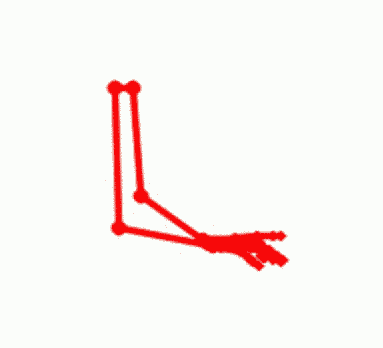

# Audio2BodyDynamics

## Introduction
This repository contains the code to predict skeleton movements that correspond to music, published in:
* [Audio To Body   Dynamics](http://openaccess.thecvf.com/content_cvpr_2018/papers/Shlizerman_Audio_to_Body_CVPR_2018_paper.pdf), CVPR 2018
* Project Page https://arviolin.github.io/AudioBodyDynamics/

## Abstract
We present a method that gets as input an audio of violin
or piano playing, and outputs a video of skeleton predictions
which are further used to animate an avatar. The key
idea is to create an animation of an avatar that moves their
hands similarly to how a pianist or violinist would do, just
from audio. Notably, it’s not clear if body movement can
be predicted from music at all and our aim in this work is
to explore this possibility. In this paper, we present the first
result that shows that natural body dynamics can be predicted.
We built an LSTM network that is trained on violin
and piano recital videos uploaded to the Internet. The predicted
points are applied onto a rigged avatar to create the
animation

## Predicted Skeleton Video


## Getting Started

* Install requirements by running: `pip install -r requirements.txt`
* Download [ffmpeg](https://www.ffmpeg.org/download.html) to enable visualization
* This repository contains starter data in the **data** folder. We provide json files formatted as follows
  * Naming convention - {**split**}_{**body part**}.json
  * **video_id**  : **(audio mfcc features, keypoints)**
  * keypoints : NxC where N is the number of frames and C is the number of keypoints
  * audio mfcc features : NxD where N is the number of frames and D is the number of MFCC Features


## Training Instructions for training on All Keypoints together

* Run python **pytorch\_A2B_dynamics.py --help** for argument list
* For training
  * python pytorch\_A2B_dynamics.py --logfldr {...} --data data/train_all.json --device {...} ...
  * See run_pipeline.sh for an example
* For testing - generates video from test model
  * python pytorch\_A2B\_dynamics.py --test_model {...} --logfldr {...} --data test_all.json --device {...} ... --audio_file {...} --batch_size 1
   * See run_pipeline.sh for an example
   * **NB** : Testing is constrained to 1 video at a time. We restrict batch size to 1 for the test video and proceed to generate the whole test sequence at once instead of breaking it up.

## Training Instructions for separate training of Body, Lefthand and Righthand

* We expose data and functionality for training and testing on key-points of  individual parts of the body and stitching the final results into a single video.
* **sh run_pipeline.sh**
* Outputs are by default logged to **$HOME/logfldr**

## Other Quirks
*  Checkpointing saves training data statistics for use in testing.  
*  Modify FFMPEG_LOC in visualize.py to specify the path to ffmpeg.
  * Set the --visualize flag to turn off visualization during testing
*  The losses observed for provided data are different from those reported in the paper due to different resolution of train and test images used for this dataset.

## Citation

Please cite the [Audio To Body Dynamics paper](http://openaccess.thecvf.com/content_cvpr_2018/papers/Shlizerman_Audio_to_Body_CVPR_2018_paper.pdf) if you use this code:
```
@inproceedings{shlizerman2018audio,
  title={Audio to body dynamics},
  author={Shlizerman, Eli and Dery, Lucio and Schoen, Hayden and Kemelmacher-Shlizerman, Ira}
  journal={CVPR, IEEE Computer Society Conference on Computer Vision and Pattern Recognition}
  year={2018}
}
```

## License
Audio2BodyDynamics is Non-Commercial Creative Commons Licensed. Please refer to [LICENSE](LICENSE).
